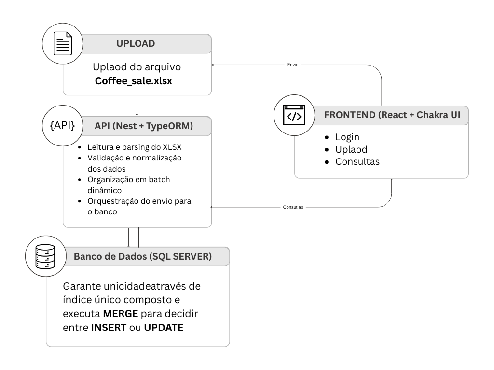

☕ Sistema de Análise de Vendas de Café

## 1. Contexto do Desafio

Este projeto foi desenvolvido como parte de um desafio técnico com o objetivo de construir uma aplicação **full stack** capaz de importar, processar e visualizar dados de vendas de café a partir de arquivos Excel.

O foco principal da solução é garantir **consistência dos dados**, **reprocessamento seguro** e **evitar duplicidade** durante a importação de arquivos.

O sistema permite:
- Importação de arquivos `.xlsx`
- Persistência dos dados em banco relacional
- Processamento de métricas relevantes (ex: cafés mais vendidos, meses mais lucrativos)
- Visualização dos dados por meio de dashboards e filtros

---

## 2. Tecnologias e Frameworks Utilizados

### Frontend
- React
- Chakra UI
- TypeScript
- Axios

### Backend
- NestJS
- TypeORM
- SQL Server
- TypeScript
- JWT (Autenticação)

### Infraestrutura
- Docker
- Docker Compose

---

## 3. Justificativa da Combinação de Tecnologias

### React + Chakra UI
- Arquitetura baseada em componentes, facilitando manutenção e escalabilidade.
- Componentes acessíveis, reutilizáveis e bem documentados.
- Redução significativa de código de estilização manual.
- TypeScript adiciona segurança e previsibilidade no desenvolvimento frontend.

### NestJS + TypeORM
- Estrutura modular, organizada e escalável.
- Uso de injeção de dependência e decorators, promovendo boas práticas.
- Separação clara de responsabilidades (controllers, services, repositories).
- Mapeamento objeto-relacional eficiente, reduzindo código boilerplate.
- Padronização do código backend com TypeScript.

### SQL Server
- Banco de dados relacional robusto, adequado para dados estruturados.
- Suporte a consultas complexas e agregações.
- Integração estável com TypeORM.
- Boa performance para operações de upsert em massa.

### Docker
- Padroniza o ambiente de desenvolvimento e execução.
- Elimina problemas de dependências locais.
- Facilita a execução do projeto em diferentes máquinas.
- Simplifica o deploy e a escalabilidade da aplicação.

A combinação dessas tecnologias garante **produtividade**, **organização**, **escalabilidade** e **facilidade de manutenção**.

---

## 4. Fluxo da Solução

1. O usuário acessa a aplicação web.
2. Realiza o upload de um arquivo Excel contendo os dados de vendas.
3. O frontend envia o arquivo para o backend via API.
4. O backend valida o tipo do arquivo e processa os dados.
5. Os dados são persistidos no banco utilizando operações de **upsert com chave única composta**.
6. O backend expõe endpoints para consultas analíticas.
7. O frontend consome essa API e exibe o dashboard.
8. Todos os serviços são executados em containers Docker.



---

## 5. Diagrama das Tabelas

O modelo de dados garante **rastreabilidade**, **integridade** e **reprocessamento seguro** das importações.

### Entidades e Relacionamentos

- **users 1:N file_imports**  
  Um usuário pode importar vários arquivos.

- **users 1:N coffee_sales**  
  Um usuário pode possuir várias vendas registradas.

- **file_imports 1:N coffee_sales**  
  Um arquivo importado pode gerar vários registros de vendas.

A deduplicação é garantida por:
- Índice único composto (`userId`, `coffeeName`, `datetime`)
- Operações de **upsert** no banco

Isso permite reprocessamento seguro dos arquivos sem duplicidade de dados.


---

## 6. Endpoints Principais

Endpoints responsáveis pela importação e consultas analíticas do sistema.


## 6. Endpoints Principais
Endpoints responsáveis pela importação e consultas analíticas do sistema.

Importação de Arquivos
```
    POST - /file-imports/:userId
```
---

Retorna os meses com maior faturamento considerando o valor total de vendas.
```
    GET /coffee-sales/get-most-profitable-months/:limit
```
---
Importação de arquivos Excel (.xlsx) com validação e reprocessamento seguro.
```
    GET /coffee-sales/get-sellings-coffees/:limit
```
---

Criação de usuário.
```
    POST /users
```
---

Autenticação e geração de token JWT.
```
    POST /auth/login
```
---
## 7. Execução do Sistema com Docker

### Pré-requisitos
- Docker
- Docker Compose

### Execução
Na raiz do projeto:
```bash
docker-compose up --build
```

## 8. Execução do Sistema local
### Execução Local - Backend
```cd coffee-backend-analysis
    npm install
    npm run migration:run
    npm run start:dev
```
### Execução Local - FrontEnd
```cd coffee-frontend-analysis
    npm install
    npm start
```
